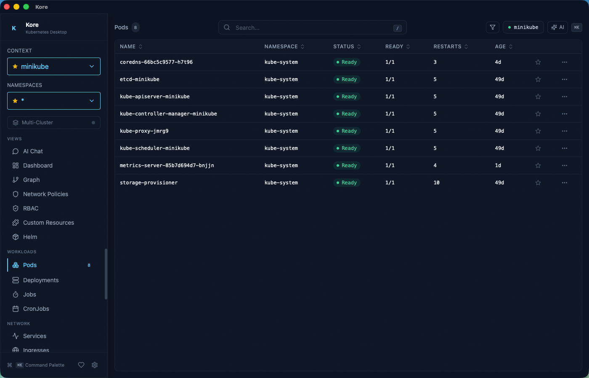
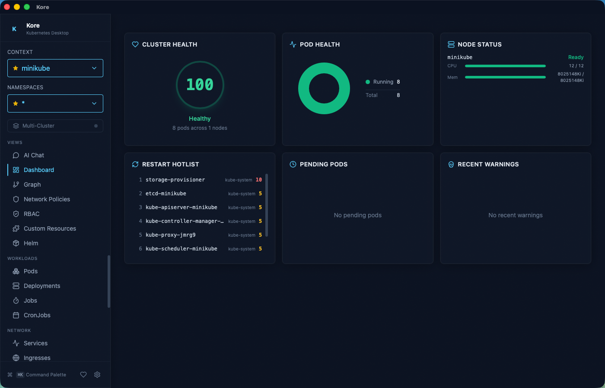
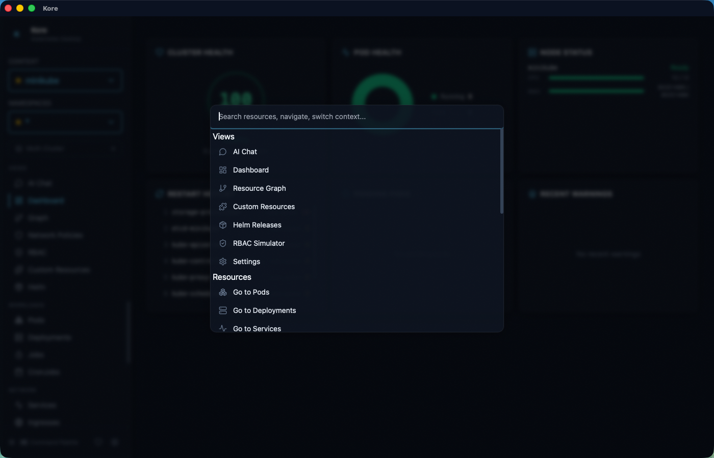
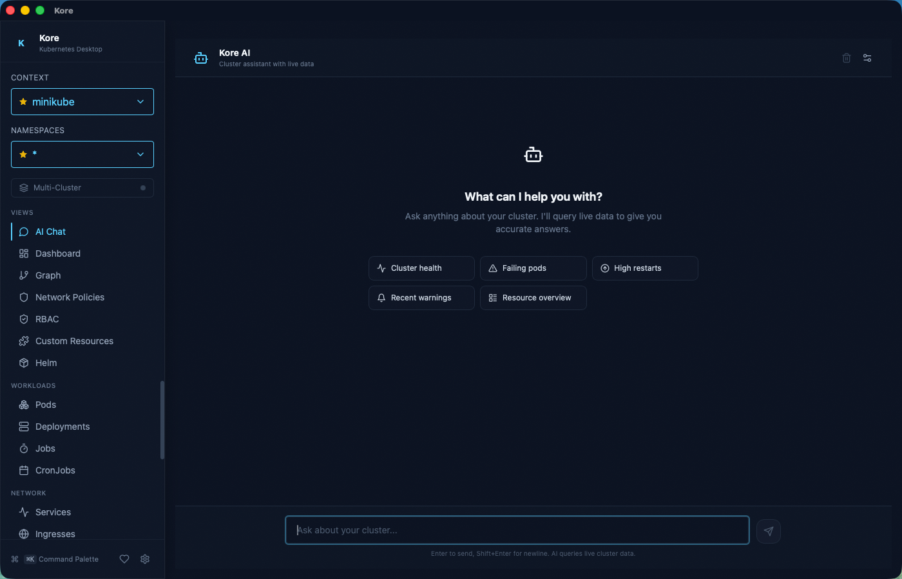

<p align="center">
  
</p>

<h1 align="center">Kore</h1>

<p align="center">
  A fast, terminal-inspired Kubernetes IDE for macOS — built with Tauri v2, Rust, and React.
</p>

---

## What is Kore?

Kore is a native macOS desktop app that brings a **k9s-style**, keyboard-driven experience to Kubernetes cluster management — without living in the terminal. It pairs a **Rust backend** (powered by [kube-rs](https://github.com/kube-rs/kube)) with a **React frontend** (Vite + Tailwind + shadcn/ui) inside a lightweight [Tauri v2](https://v2.tauri.app/) shell.

If you spend your day switching between `kubectl`, `k9s`, Lens, and your browser to manage clusters, Kore consolidates that workflow into a single, fast, keyboard-first app.

## Why Kore?

- **Native performance** — Rust backend with direct Kubernetes API access, no Electron overhead.
- **Real-time** — Resources are streamed via Kubernetes watch API; changes appear instantly.
- **Keyboard-driven** — Navigate entirely with keyboard shortcuts, vim-style bindings, and a command palette (`Cmd+K`).
- **Multi-cluster** — View and compare resources across multiple contexts side-by-side.
- **AI-assisted troubleshooting** — Diagnose issues with built-in AI support (OpenAI, Anthropic, or Ollama).

## Screenshots

<p align="center">
  
</p>
<p align="center"><em>Resource table with live status updates, sortable columns, and keyboard navigation</em></p>

<p align="center">
  
</p>
<p align="center"><em>Cluster dashboard with health score, pod status ring chart, node resource bars, and restart hotlist</em></p>

<p align="center">
  
</p>
<p align="center"><em>Command palette (<code>Cmd+K</code>) for instant access to views, resources, and actions</em></p>

<p align="center">
  
</p>
<p align="center"><em>AI-assisted troubleshooting with cluster-aware suggestions and live data queries</em></p>

## Features

| Category | Details |
|---|---|
| **Resource Management** | Browse, describe, edit YAML, and delete across 10 resource types: Pods, Deployments, Services, Nodes, Events, ConfigMaps, Secrets, Ingresses, Jobs, CronJobs |
| **Real-time Watches** | Live-streaming resource updates via Kubernetes watch API |
| **Pod Operations** | Logs (single & multi-pod), exec shell (xterm.js), metrics (CPU/memory charts), port forwarding |
| **Deployments** | Revision history, image diffs, one-click rollback |
| **YAML Editor** | View, edit, and apply YAML with side-by-side diff preview |
| **CRD Browser** | Discover and browse Custom Resource Definitions dynamically |
| **Dependency Graph** | Interactive SVG graph of resource relationships (ownerReferences + label selectors) |
| **Helm** | List releases, inspect values/manifests/history, rollback |
| **Cluster Dashboard** | Health score (0–100), pod status ring chart, node resource bars, restart hotlist |
| **Event History** | Live events with persistent SQLite history and time-range filtering |
| **Multi-Cluster** | Compare resources across contexts in a unified view |
| **AI Troubleshooting** | Streaming AI chat panel — supports OpenAI, Anthropic, and Ollama |
| **RBAC Simulator** | Permission matrix, role browser, reverse lookup, forbidden error analysis, natural language queries, and identity impersonation |
| **Command Palette** | `Cmd+K` for resource search, view switching, quick filters, and actions |
| **Label Filtering** | Filter resources by label selectors |
| **Pinned Resources** | Bookmark frequently accessed resources in the sidebar |
| **Settings** | Accent color, event retention, keyboard shortcut customization |

## Keyboard Shortcuts

| Shortcut | Action |
|---|---|
| `Cmd+K` | Open command palette |
| `/` | Focus search |
| `j` / `k` | Navigate rows up/down |
| `l` | Enter detail view |
| `h` | Go back |
| `1`–`6` | Switch tabs in detail views |
| `?` | Show shortcut overlay |
| `Cmd+Shift+R` | Open RBAC Simulator |

## Prerequisites

- **macOS 14+**
- **Rust** stable toolchain + `cargo`
- **Node.js 18+** and `npm`
- **Xcode Command Line Tools** — `xcode-select --install`
- A valid `~/.kube/config` with at least one reachable context
- *(Optional)* `helm` in `PATH` for Helm features
- *(Optional)* `kubectl` in `PATH` for port forwarding and exec

For full Tauri prerequisites, see the [Tauri v2 docs](https://v2.tauri.app/start/prerequisites/).

## Getting Started

```bash
# Clone the repository
git clone https://github.com/eladbash/kore.git
cd kore

# Install frontend dependencies
npm install

# Run in development mode (launches Vite + Tauri dev window)
npm run tauri:dev
```

The app will open a native window connected to your active kubeconfig context.

## Available Scripts

| Command | Description |
|---|---|
| `npm run tauri:dev` | Full app dev mode (Vite + Tauri) — **primary dev command** |
| `npm run tauri:build` | Production macOS binary |
| `npm run dev` | Frontend only (Vite dev server on `localhost:5173`) |
| `npm run build` | TypeScript check + Vite production build |
| `npm run lint` | ESLint |
| `npm run lint:fix` | ESLint with auto-fix |
| `npm run format` | Prettier format |
| `npm run format:check` | Prettier check |
| `npm run test` | Run frontend unit tests (Vitest) |
| `npm run test:watch` | Run tests in watch mode |
| `npm run rust:check` | Cargo clippy on the Rust backend |
| `npm run rust:fmt` | Cargo fmt on the Rust backend |

## Architecture

Kore uses a **two-process model**:

```
┌─────────────────────────────────┐
│         Tauri Shell             │
│                                 │
│  ┌───────────┐  ┌────────────┐  │
│  │   Rust    │  │   React    │  │
│  │  Backend  │◄─►  Frontend  │  │
│  │ (kube-rs) │  │(Vite+React)│  │
│  └───────────┘  └────────────┘  │
│                                 │
│  invoke (req/res) + events (push)│
└─────────────────────────────────┘
```

- **Backend** (`src-tauri/src/`) — Rust process handling all Kubernetes API calls, streaming watches, pod exec sessions, port forwarding, SQLite event storage, and AI provider integration.
- **Frontend** (`src/`) — React app rendered in a native webview with TanStack Table, Recharts, xterm.js, cmdk, and Framer Motion.
- **Communication** — Tauri `invoke` for request/response and Tauri `events` for streaming (logs, watches, AI responses, exec I/O).

## Project Structure

```
kore/
├── src/                    # React frontend
│   ├── components/         # UI components (30+ files)
│   ├── hooks/              # Custom React hooks
│   ├── lib/                # API wrappers, types, transforms, utils
│   └── App.tsx             # Root component
├── src-tauri/              # Rust backend
│   └── src/
│       ├── main.rs         # Tauri app setup
│       ├── commands.rs     # ~30 Tauri command handlers
│       └── state/          # Core K8s logic (resources, logs, exec,
│                           #   metrics, yaml, rollback, dashboard,
│                           #   helm, CRDs, graph, AI, multi-cluster...)
├── package.json
├── vite.config.ts
├── tailwind.config.js
└── tsconfig.json
```

## Tech Stack

**Backend (Rust)**
- [kube-rs](https://github.com/kube-rs/kube) + k8s-openapi — Kubernetes API client
- [Tauri v2](https://v2.tauri.app/) — Native app shell and IPC
- tokio — Async runtime
- rusqlite — SQLite for persistent event history
- reqwest — HTTP client for AI providers
- similar — Diff algorithm for YAML comparison

**Frontend (TypeScript/React)**
- React 18 + Vite
- TanStack Table — Resource tables
- Recharts — Charts and metrics visualization
- xterm.js — Terminal emulator for pod exec
- cmdk — Command palette
- Framer Motion — Animations
- Tailwind CSS — Styling
- Lucide React — Icons

## Contributing

Contributions are welcome! Here's how to get started:

1. **Fork** the repository
2. **Create a branch** for your feature or fix: `git checkout -b feat/my-feature`
3. **Make your changes** and ensure they pass checks:
   ```bash
   npm run lint
   npm run test
   cd src-tauri && cargo clippy
   ```
4. **Commit** with a clear message describing the change
5. **Open a Pull Request** against `main`

### Guidelines

- Follow existing code patterns and directory structure
- Frontend code uses the `@` path alias (maps to `src/`)
- Rust backend follows the modular structure in `src-tauri/src/state/`
- Keep PRs focused — one feature or fix per PR
- Add tests for new frontend logic where appropriate

## License

MIT
